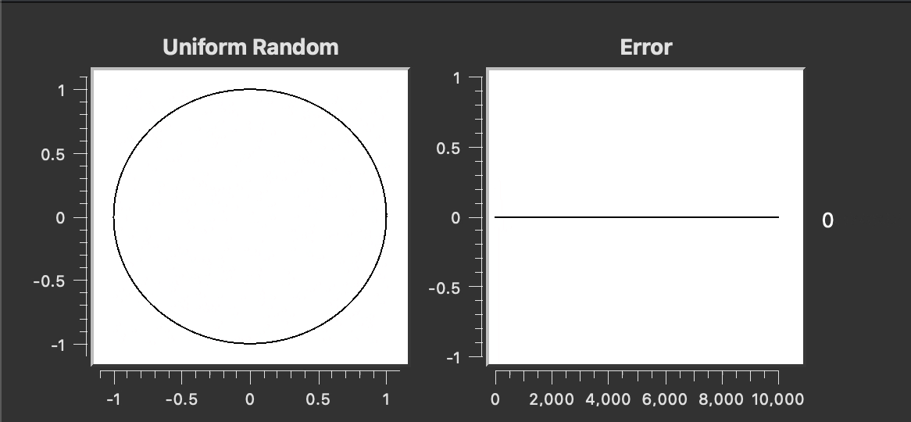

## Introduction
An interesting application of Monte Carlo methods is estimating the value of pi. By estimating the area of a unit circle and using the equation of the area of a circle, we can find pi. This is part of exercise 6.5 in the computational physics textbook by Landau (2015)[^1] on Monte Carlo integration.

## Finding Pi
To demonstrate multi dimentsional Monte Carlo methods, we try to find the value of pi by approximating the area of a circle. To do this, we take a circle inscribed inside a square with lengths in interval [-1, 1]. By throwing random points within the interval and finding the ratio between the number of points inside the circle and the total number of points, we can approximate the area. Since the radius of the circle is 1, the area that we retrieve in this method should converge to pi.

## Quasi-random Sequences
Randomness in computers are usually implemented using pseudo-random sequences. Although it is possible to use numbers generated using pseudo-random sequences for Monte Carlo methods, it is possible to achieve faster convergence using quasi-random sequences instead. Quasi-random sequences, also known as low-discrepancy sequence provide an improvement as it covers the space more evenly than normal random sequences.

### Halton Sequence
The Halton sequence is generated by choosing a base number and dividing the chosen interval up by that base number. Each dimension is then generated with this sequence by choosing base numbers that are coprime for each dimension. For example, if we chose 2 as the base number and an interval (0,1), we would get this sequence:  

$$\frac{1}{2}, \frac{1}{4}, \frac{3}{4}, \frac{1}{8}, \frac{5}{8}, \frac{3}{8}, \frac{7}{8}, \dots$$
 

We could then chose 3 as the base number for the next dimension to get this sequence: 

$$\frac{1}{3}, \frac{2}{3}, \frac{1}{9}, \frac{4}{9}, \frac{7}{9}, \frac{2}{9}, \frac{5}{8}, \dots$$

### Sobol Sequence
The implementation of the sobol sequence follows the paper by Bratley and Fox (1988)[^2].
Suppose we want to generate a sequence  

$$x_1, x_2, \dots, x_n$$ 
 

To do this, we first generate "direction numbers" $v_i$ that can be obtained by taking a primitive polynomial of the form: 

$$P = x^s+a_1x^{s-1}+a_2x^{s-2}+\dots+a_{s-1}x+1$$
 

with coefficients $a_i$ being either 0 or 1 and use the coefficients of the polynomial to obtain the direction numbers with the recurrence relation defined as  

$$v_i = a_1v_{i-1}\ ^\wedge \ a_1v_{i-2} \ ^\wedge \ \dots\ ^\wedge \ a_{s-1}v_{i-s+1}\ ^\wedge \ v_{i-s}\ ^\wedge \ (v_{i-s}>>d)$$
 

where ^ is the bitwise XOR operator and >> is the bitwise right shift operator (shifting right by $d$ in this case). A better way to compute this relation is by defining it with respect to $m_i$ where $m_{i} = v_{i} << i$ ($v_i$ with bitwise left shift by $i$) as

$$m_i = 2a_1m_{i-1}\ ^\wedge \ 2^2a_2m_{i-2}\ ^\wedge \ \dots \ ^\wedge \ 2^{s-1}a_{i-s+1}\ ^\wedge \ 2^dm_{i-s} \ ^\wedge \ m_{i-s}$$
 

With this, we can then get the points for the sobol sequence as
$$x_i = x_{i-1}\ ^\wedge $$

#### Direction Numbers
The direction numbers are prrovided by Stephen Joe and Frances Kuo[^3]. Although we require only 2 dimensions, the numbers provided support up to 21201 dimensions. 

[^1]: Landau, R. H. (2015). Computational physics problem solving with python. John Wiley & Sons, Incorporated. 

[^2]: Bratley and Fox (1988) Algorithm 659: Implementing Sobol's quasirandom sequence generator

[^3]: https://web.maths.unsw.edu.au/~fkuo/sobol/
